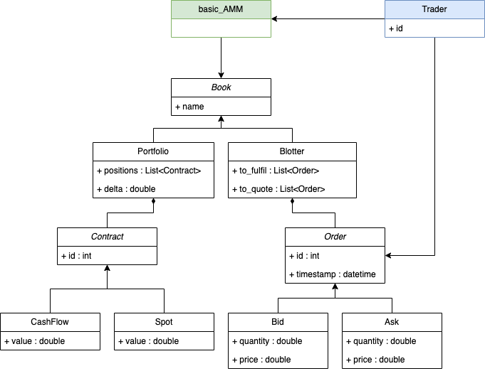

# basic_AMM

## Description

Application to automating market marking. Given a starting posiiton the application will process automatically new orders (Bid / Ask) the underlying is not specified yet - we consider only one comon underlying shared across all oreders and contracts.

The MM has two books: a blotter and a portfolio. 
In the blotter he manages the orders received from different clients. 
In the portfolio he manages his own position & risk.

### Blotter

The blotter is composed of two priority queues composed of orders and compared by their timestamp.

One is for the orders to fulfil; 
Second is for the orders to quote.

#### Asks

#### Bids

### Hedging

The portfolio manages 

## Code

### UML
Classes : 

### Technologies Used

- Langage : C++
- Libraries : [NetCom](https://github.com/alchekroun/NetCom)

### RoadMap

Everything yet

### Authors

Myself